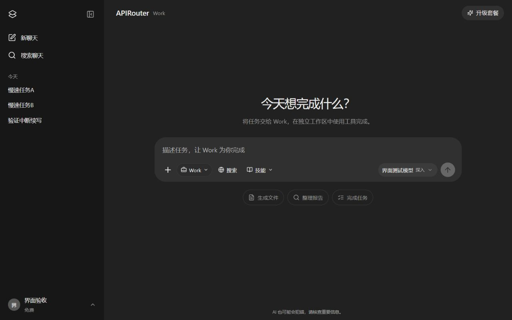
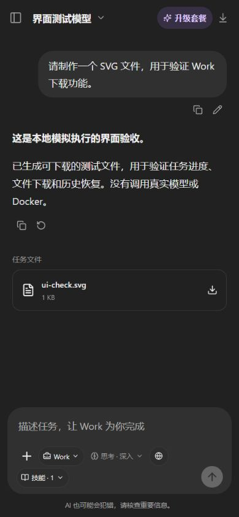

# APIRouter

**部署在自己 VPS 上的 AI 工作空间，支持 Chat / Work、Docker 沙箱、中断续写、多 API 来源、自动切换与会员订阅。**

APIRouter 提供接近 ChatGPT 网页版的聊天体验，将模型接入、渠道管理、成员邀请和套餐配置集中到一个站点。浏览器通过本站后端调用模型，管理员在网页中配置服务地址与 API Key，成员无需自行填写密钥。

适合个人与受邀成员使用。当前版本采用单实例部署，无需显卡，也无需在 VPS 上运行大模型。

[快速开始](#快速开始) · [VPS 部署指南](docs/DEPLOY-VPS.md) · [Work 沙箱](docs/WORK.md) · [会员与支付](docs/MEMBERSHIP.md) · [对外 API](docs/EXPORTED-API.md) · [接口文档](docs/API-CONTRACT.md)

> 本项目使用独立的名称与图标，与 OpenAI、ChatGPT 无隶属关系。本站套餐由站点管理员提供，与 ChatGPT 官方订阅互不通用。

## 功能

| 模块 | 支持内容 |
| --- | --- |
| 聊天体验 | 流式回答、思考过程默认折叠、停止生成、中断续写、Markdown、LaTeX 数学公式、代码高亮与复制、编辑重发、重新生成、Markdown 导出 |
| 对话管理 | 新建、搜索、重命名、置顶、归档与删除；桌面侧栏折叠、移动端布局、深浅主题 |
| 多设备登录 | 长期登录、多设备同时在线；显示登录 IP、GeoIP 属地、设备类型；管理员可按成员查看登录设备；退出指定设备或其他所有设备，普通退出仅影响当前浏览器 |
| 模型接入 | 直接 API 或 Claude Code；OpenAI Chat Completions、Responses、Anthropic Messages；多个地址与 Key 独立配置 |
| 模型管理 | 按统一模型分组、展开管理各渠道；同步容量信息、手动添加、识图、测试、思考强度与上下文配置 |
| Work 任务 | 普通 API 驱动独立 Docker 沙箱，子任务、技能、读写文件、执行代码、按需搜索、实际文件下载；Claude Code 可选 |
| 连接管理 | 粘贴识别 New API JSON / 环境变量；余额或额度查询；明文或加密备份全部渠道及模型映射 |
| 对外 API | 创建独立本站密钥、按渠道模型授权、导出调用配置；以原始上游模型 ID 提供三种原生协议接口 |
| 问题诊断 | 管理员查看上游原始错误正文、状态码与请求信息；凭据脱敏、加密保存；成员侧隐藏渠道 |
| 渠道路由 | 模型下自定义版本、版本内多渠道映射、每模型重试次数、优先级与失败切换、失败冷却、用户专属有序备用方案与中断接续 |
| 文件分析 | PDF、DOCX、XLSX、UTF-8 文本与代码提取；支持向具备视觉能力的模型发送图片 |
| 成员管理 | 首次管理员设置码、邀请注册、账号停用、每模型版本独立日/月额度、指定用户专属模型路由、全站或指定用户聊天导出、用户间对话与附件隔离 |
| 套餐订阅 | 自定义月付/年付价格、额度与模型范围；Stripe 自动订阅、人工申请审批、管理员直接指定成员套餐与期限 |
| 站内公告 | 管理员编辑草稿、发布与下架；Markdown 和数学公式；关闭后按账号同步已读，更新后重新展示 |
| 部署运维 | Docker Compose、Caddy 自动 HTTPS、SQLite 持久化、备份与恢复脚本 |

## 界面预览

<p align="center">
  
</p>
<p align="center">
  
</p>

截图来自本地模拟执行的界面验收，没有调用真实模型或 Docker。测试模型、账号与套餐不随正式部署初始化，首次安装需自行配置。

## 快速开始

### VPS 一键部署

准备一个域名，将其解析到 VPS，并开放 TCP 80、443 端口。将本仓库源码放到服务器目录，例如 `/opt/APIRouter`，然后执行：

```bash
cd /opt/APIRouter
sudo bash deploy.sh chat.example.com --install-docker --with-work
```

将 `chat.example.com` 替换为自己的域名。脚本会构建应用、通用 Docker 工作沙箱和 HTTPS 入口；在支持的 Ubuntu/Debian 系统上，`--install-docker` 可安装 Docker。已有 Docker 时不会重新安装。仅需直接 API 聊天可去掉 `--with-work`，日后运行 `sudo bash deploy/work-enable.sh` 即可启用 Work。默认 Work 不安装 Claude Code；需要该可选引擎时再运行 `sudo bash deploy.sh --with-claude-code`。

打开 `https://你的域名`，使用终端日志中的**首次管理员设置码**创建账号。若需要再次查看日志：

```bash
sudo docker compose logs --tail=30 app
```

没有内置默认密码。创建管理员后，其他用户需要邀请链接才能注册。

同一账号可在电脑、手机和不同浏览器同时登录。进入“个人设置 → 登录设备”可查看登录 IP、近似属地、设备类型和活动时间。服务器会话不设到期时间，同一浏览器的多个标签页共用会话；浏览器凭据自动续期，清除网站数据后仍需重新登录。账号菜单退出只影响当前浏览器，修改密码会退出其他设备。聊天记录、套餐及使用额度按账号共用。

管理员还可以在“成员与邀请”中展开指定成员的“登录设备”，查看该账号当前有效的登录记录，包括 IP、属地、设备类型和活动时间。普通成员只能查看自己的设备；已退出的设备不包含在列表中。

GeoIP 使用随依赖安装的本地数据库，不调用外部 IP 查询接口。归属地可能不精确或过时；内网地址显示本地网络，旧会话未记录的 IP 不会补造。数据库增加约 110 MiB 磁盘占用，运行时建议额外预留约 150 MiB 内存。更新与反向代理配置见 [部署指南](docs/DEPLOY-VPS.md#登录-ip-与-geoip)。

本产品包含 [MaxMind](https://www.maxmind.com/) 创建的 GeoLite2 数据。随包数据库采用 [CC BY-SA 4.0](https://creativecommons.org/licenses/by-sa/4.0/)，`geoip-lite` 库采用 Apache-2.0，详见其 [许可说明](https://github.com/geoip-lite/node-geoip/blob/main/LICENSE)。

上传源码、系统要求、域名配置、已有反向代理、更新及恢复流程，见 [VPS 一键部署指南](docs/DEPLOY-VPS.md)。

### 配置起点

| 资源 | 参考配置 |
| --- | --- |
| CPU | 2 核起步 |
| 内存 | 直接 API 聊天从 2 GB 起步；Claude Code / Work 建议 4 GB 起步，多任务需增加余量 |
| 磁盘 | 聊天至少预留 10 GB；含 Work 建议 20 GB，随镜像、文件及备份增加 |
| GPU | 不需要，推理由上游 API 服务商完成 |

以上为按实现估算的起点，尚未经过生产容量压测。默认全站最多同时生成 10 条回复、每位用户 4 条，不同对话可并行，同一对话按顺序执行；执行器另限同时 2 个沙箱，每个默认 768 MB / 1 CPU / 10 分钟。这些是保护限额，不代表经过验证的承载能力。可在后台调整 Work 资源。

### 本地开发

需要 **Node.js 24 或更高版本**。项目使用 Node.js 内置 SQLite。

```bash
npm ci
npm run dev
```

打开 `http://localhost:5173`，从终端获取首次管理员设置码。

构建并启动单独的应用服务：

```bash
npm ci
npm run build
npm start
```

默认监听 `127.0.0.1:3001`。公网运行应使用 HTTPS 反向代理；Docker 部署已包含对应配置。

## 首次配置

1. 打开左下角账户菜单，进入**管理工作空间**。
2. 在 **API 连接**添加地址、协议与 Key，或粘贴 New API 导出的连接 JSON，检查识别预览后保存。普通 Chat 和 Work 都可选择“直接 API”；只有可选 Claude Code 运行方式需要兼容的 Anthropic Messages 渠道及对应镜像。
3. 同步模型列表；若上游不提供列表接口，可在**模型**页手动填写真实模型 ID。
4. 启用需要开放的模型并设置默认模型。新同步的模型默认禁用；图片输入需单独开启“识图”。
5. 执行一次模型测试，确认当前密钥可以调用。测试会消耗少量上游额度。
6. 在后台 **Work** 查看执行器状态、设置资源、导入技能；聊天输入区可选 Chat / Work、模型和思考强度。普通 API 的 Work 需要上游支持工具调用。
7. 在**成员与邀请**中创建邀请，或进入**套餐与支付**配置会员方案。

保存 API 配置后无需重启服务。模型列表同步成功与真实调用成功分别记录，列表中存在某个模型并不代表当前账号一定有调用权限。

AnyRouter 的 GPT / Codex 风格接口选择“直接 API”与 Responses，使用自动或显式 Codex 兼容配置；自动模式仅对 `anyrouter.top` 启用该适配，其他域名保留标准格式。适配共享于 Chat 和原生 Work，不安装 Codex CLI，也不能保证专属 Key 的调用权限。Codex 兼容模式不发送 `max_output_tokens`，单次长度使用上游默认值；标准 Responses 继续使用站点输出上限。Claude 专属接口则使用 Anthropic Messages 与可选 Claude Code 引擎。真实 AnyRouter 账号仍需自行测试。

思考强度默认“自动”，不会额外向直接 API 发送强度参数。管理员按各渠道实际支持的档位配置；显式选择强度后只路由到兼容渠道。余额查询需要选择服务商支持的适配方式，不支持查询的渠道会显示“不可用”；New API 的令牌额度不等同于账户余额或美元金额。

带有协议字段、阶段标记或开头 `<think>` / `<thinking>` 标签的过程内容会单独保存到默认收起的“思考与过程”，点击可展开；复制和导出只包含正文。支持直接 API、原生 Work 与 Claude Code，刷新、中断续写和重启恢复保留两者的区分。加密内容和签名不展示。如果上游把过程与正文拼成没有标记的纯文本，无法可靠自动拆分；旧版已经混存的普通文本不会被猜测性改写。

上下文容量和模型最大输出可从上游模型列表同步，也可由管理员按提供商规格设置。对话历史不再按固定 300 条静默截断；容量未知时完整发送可容纳的历史，由上游判断真实限制。已知容量用于选择更合适的渠道，估算不等同于服务商的 tokenizer。消息请求（含 JSON 包装）与完整历史传输仍有 32 MB 安全上限，达到时明确提示，不悄悄裁剪。

回答超时、断网、主动停止或重启后，点击原回答的**继续生成**，也可发送“继续”。新内容追加到已有回答，原有文字保留；原生 Work 同时恢复已保存的文件与工具检查点，已完成的工具不会自动重放。检查点之间未保存的进程状态和上游隐藏状态无法恢复；续写是新请求，模型可能出现重复或改写，系统只自动移除足够长的精确重复片段。

管理员在 API 连接页可下载所有渠道备份，包含完整密钥和模型映射。导出前验证当前账户密码；加密备份使用独立密码、scrypt 和 AES-256-GCM，可再次粘贴或上传导入。该备份不含用户和聊天记录，站点迁移仍需完整数据备份。

## 多来源与自动切换

每个 API 连接都是独立渠道，可使用不同的地址、密钥、协议和上游模型 ID。认证方式支持按协议自动选择、`Authorization: Bearer` 和 `x-api-key`。

在“模型 → 模型与版本”中先创建用户看到的模型名称，再添加版本并勾选对应渠道的上游模型。例如 `ChatGPT 6 Astra` 下可以设置“高智商版”“普通版”“降智版”，分别绑定不同来源。用户按模型、版本、思考强度选择；普通渠道重试限定在同一模型版本内。需要跨模型接续时，为指定成员显式配置“专属模型路由”的备用方案。

已有模型可以直接在“配置”中修改名称。改名会同步渠道分配、用户版本限额及已用次数、专属路由、套餐模型范围和聊天引用，不需要重新建模。旧页面提交的模型标识会兼容到新名称；同名模型不会被自动合并。

“上游模型与测试”支持在搜索框右侧按渠道筛选。搜索和渠道筛选同时生效，结果只显示匹配的渠道记录，已启用渠道及模型优先排列；这个显示顺序不改变请求路由优先级。

例如：

| 配置 | 主渠道 | 备用渠道 |
| --- | --- | --- |
| 上游模型 ID | `vendor/model-a` | `model-a` |
| 统一模型名 | `model-a` | `model-a` |
| 版本名称 | `高智商版` | `高智商版` |
| 优先级 | 100 | 50 |

以上模型 ID 仅为示例。管理员应确认映射后的模型能力相当，并允许它们互相替代。

默认策略如下，相关参数可在后台调整：

| 情况 | 默认行为 |
| --- | --- |
| 网络错误、超时、HTTP 5xx | 当前渠道最多额外重试 1 次，再尝试备用渠道 |
| HTTP 401 / 403 / 404 / 429 | 直接尝试备用渠道，不立即重试同一渠道 |
| 同一渠道的同一模型连续失败 3 次 | 冷却 60 秒，期间跳过该模型渠道 |
| 冷却结束 | 下一次请求触发单次恢复探测，成功后恢复使用 |
| 每个执行方案 | 默认最多尝试 6 次，包含首次调用与重试；全局可设为 1–100 次 |
| 已经输出正文后中断 | 保留已有内容；有用户专属备用方案时顺次携带内容接续，否则等待用户点击继续 |
| Work 已经开始工具调用 | 只有原生 Work 的已保存检查点可安全交接时才转入备用方案；缺少可靠记录或 CLI 已执行操作时停止，保留已有结果 |

失败保护可在 API 连接中开启或关闭，设置连续失败次数（1–1000）与暂时禁用分钟数（最长 30 天）。每条上游模型记录还能单独覆盖开关、次数与时长，留空继承渠道设置；关闭保护仍保留重试、切换和错误日志。修改保护策略会重置该记录的健康计数。

每条上游模型记录可单独设置失败后的额外重试次数（0–10），留空继承全局设置（0–3，默认 1）。例如设为 3 表示首次调用外最多重试 3 次，仍受该方案的总尝试上限约束。重试次数只影响可重试的临时错误，不会强制重试鉴权失败或无效参数；配置会随渠道备份导出。

用户主动停止不会触发备用方案。普通渠道层在无效参数、已经输出正文或已提交工具操作后停止重试；显式用户备用方案由外层接续逻辑处理，仍受文件、上下文及本地安全限制。后台可查看最近 200 条尝试记录及加密保存的原始错误正文，也可手动重置渠道健康状态。HTTP 错误正文最多保存 1 MB；沙箱网关最多 128 KB，截断会标注。密钥会脱敏，原始 HTML 仅按文字显示。普通用户的模型与消息接口不返回渠道名称、地址或上游模型映射。

## 用户模型额度与聊天导出

在“成员与邀请 → 各模型版本使用额度”中，为每位用户的每个模型版本分别设置每日、每月请求次数。例如高智商版每天 10 次、普通版每天 100 次，各版本独立计数，同版本的多个渠道共用这一版本的额度。留空表示不设置该项额外限制，0 表示禁止使用。原有成员或套餐总额度仍同时生效。

版本额度按台北时间（UTC+8）自然日、自然月重置。新生成、继续、重新生成各占一次，失败或停止也计数；同一请求中的渠道重试不重复占用次数。额度检查与占用在同一事务完成，防止并发超用。

管理员可在“成员与邀请 → 导出聊天记录”选择所有用户或指定用户，下载 JSON 或 Markdown 聊天 ZIP。指定用户导出只包含该用户的信息和聊天，也支持已停用账号；包含归档聊天、独立的思考过程、消息及文件元数据，不包含附件二进制、API 密钥、密码或支付配置。压缩包文件名区分全量与指定用户，清单记录导出范围及数量。该导出用于阅读和归档，完整迁移仍使用数据目录备份。

### 指定用户的模型路由

在成员卡片展开“专属模型路由”，可将该用户选中的模型版本映射到另一个执行版本，例如 `Opus 5.5 · 高智商版 → GPT 6 · 默认版本`。用户界面保留源模型名称，后台按目标版本调用并记录实际渠道。规则仅对指定用户生效，可添加、停用或删除；执行思考强度单独配置，默认自动。

每条规则包含首选方案及按顺序排列的备用方案，每个方案分别选择模型、版本和思考强度。备用方案不设固定数量上限，仍受请求体容量约束；可上移、下移和删除。失败、超时、空输出或上游明确报告未完成时尝试下一项，已显示文字保留并作为续写上下文。正常结束的回答不会根据文字含义推测“是否完成”。原模型只有被显式列为备用方案才会再次执行，不递归套用其他规则。

套餐权限与使用额度按用户选择的源版本计算，同一请求无论尝试多少备用方案都只占一次，不额外扣除目标版本额度；上游调用仍可能分别收费。每个方案内部独立应用渠道重试总上限。原生 Work 可交接兼容的已保存工具检查点和文件，缺少安全交接条件时保留结果并报错。规则保存在站点数据库，完整数据备份会保留这些设置。配置方法见 [成员与套餐指南](docs/MEMBERSHIP.md#指定用户的专属模型路由)。

### 数学公式

回答支持 LaTeX 行内公式 `$a^2+b^2=c^2$`、`\(a^2+b^2=c^2\)`，以及独立公式 `$$...$$`、`\[...\]`。支持分数、上下标、积分、求和、矩阵等 KaTeX 语法，公式字体随站点一起部署，无需外部 CDN。

代码块、行内代码与链接中的内容保留原文，复制和 Markdown 导出仍保留模型给出的 LaTeX 源码。较长的独立公式可横向滚动。只有数学定界符完整的内容才会渲染；普通括号、任意方括号及已经丢失定界符的文本不会被猜测转换。

**重试可能产生额外上游费用。** 本站每日额度按用户提交的生成请求计数，不按内部渠道尝试次数重复扣减；上游仍可能对每次尝试分别收费。

## 会员与支付

用户通过右上角的**升级套餐**或账户菜单中的**套餐与订阅**查看方案。管理员可配置套餐名称、说明、价格、月付/年付、每日额度、模型范围和上架状态。

| 开通方式 | 流程 |
| --- | --- |
| 申请开通 | 用户提交申请 → 管理员同意或拒绝 → 同意后按套餐周期授予权益 |
| Stripe | 用户进入 Stripe 支付页 → 服务器验证支付通知 → 确认订单与订阅后开通 |

人工申请不会自动收款，付款或开通条件由管理员核实。Stripe 支付回跳本身不会授予会员权益，后台需要验证签名通知与订单归属。

套餐权限由后端校验，覆盖模型调用与每日额度。会员到期后恢复免费方案；管理员单独设置的用户额度优先于套餐额度。已购买权益保留快照，后续改价不会直接修改旧订阅的扣款金额。

管理员也可在“成员与邀请 → 用户套餐”直接指定任意已有套餐（包括未上架套餐）或免费版，选择一个周期、自定截止时间或长期有效。指定权益立即生效，不清空已用次数，并记录操作者和说明；到期或点击“恢复原订阅”后，恢复当时仍有效的原订阅，否则使用免费版。此操作只调整站内权益，不扣款、不取消 Stripe 订阅，支付续订通知也不会覆盖管理员指定权益。

Stripe 密钥、Webhook 事件、客户门户、续费与取消规则，以及当前支持范围，见 [会员与支付指南](docs/MEMBERSHIP.md)。

## 站内公告

管理员在“管理工作空间 → 公告管理”中创建草稿、预览、发布、编辑和下架。公告支持 Markdown、链接及数学公式，不执行 HTML。只有已发布公告出现在登录后的工作空间，用户点击“知道了”或关闭即标记已读；记录保存在服务器，同账号其他设备刷新或重新聚焦后同步。编辑已发布公告或重新发布会产生新版本并再次展示。标题最多 120 字符，正文最多 20000 字符。

## 对外 API

管理员在“管理工作空间 → 对外 API”创建本站独立密钥，勾选允许的模型与渠道，复制地址或下载调用配置。完整密钥只在创建时展示一次，上游 API Key 不进入这份配置。外部客户端通过 `/v1/models` 查询原始上游模型 ID，并使用对应的 Chat Completions、Responses 或 Anthropic Messages 原生接口。

同名模型只在显式授权的渠道中调用，不使用网页别名或用户专属路由；不执行 Work 沙箱或 Claude Code。外部调用不计网页套餐及模型版本次数，上游按实际调用计费。管理员可更改授权、停用或撤销密钥。配置方法、接口示例与边界见 [对外 API 指南](docs/EXPORTED-API.md)。

## 文件与功能边界

| 输入类型 | 当前处理方式 |
| --- | --- |
| PDF | 提取文字，最多 100 页；不支持扫描件 OCR |
| DOCX | 提取文字，不保留原始排版 |
| XLSX | 读取单元格与缓存公式结果，不重新计算公式或解析图表 |
| 文本、代码 | 读取 UTF-8 内容 |
| PNG / JPEG / WebP / GIF | 发送给已开启图片输入、且上游实际支持视觉的模型 |

单文件最大 10 MB，每条消息最多 5 个文件，单个文件提取文字最多 20 万字符。每位用户默认可保存 200 MB、最多 500 个附件；删除对话会清理其中不再被引用的附件。

Work 默认由普通 API 的工具调用驱动，在 Docker 中实际读写文件和执行代码，支持分派子任务、管理员提供的 Markdown 技能，以及独立 SearXNG 搜索和受控网页读取。搜索工具支持三个 API 协议，不依赖模型服务商提供内置搜索；后台 Work 页可设置服务并测试连通性。Claude Code 是可选引擎，其搜索仍依赖 CLI 本身。镜像预装 Python、Pillow、python-docx、openpyxl、ReportLab 和 python-pptx，可用于生成文档、表格、演示文稿、PDF 或 SVG；成功与质量仍取决于模型和技能。只有实际生成的文件才提供下载；支持单文件、源码目录 ZIP 和全部任务文件打包。正文中的 sandbox: 或 output/ 链接仅匹配当前对话保存的实际文件。

**本项目不等同于完整 ChatGPT / Work。** 没有远程浏览器、语音、内置图像生成服务或关闭网页后继续执行的任务队列。工作沙箱不能任意访问互联网、挂载宿主目录或安装联网依赖。联网只通过受控搜索与公开网页读取，需实际搜索服务可用；不等同于登录网站、运行网页 JavaScript 或任意下载。技能导入目前只支持单份 `SKILL.md`，不自动安装仓库脚本、hooks 或 MCP。详细范围见 [Work 指南](docs/WORK.md)。

## 数据与信任边界

- API Key 与 Stripe 密钥在服务器端加密保存。只有管理员主动验证密码并导出 API 备份时，完整 API Key 才进入下载内容；普通成员无法读取。
- 密钥使用 AES-256-GCM 加密，默认主密钥保存在持久数据目录中的 `master.key`。
- **自托管界面不消除上游信任问题。** 选定的 API 服务商仍会处理发送给它的消息与附件，并决定返回内容。
- 用户会话和附件按账号隔离；账号默认仅向受邀成员开放。
- 成员/套餐总额度按 UTC 日期计数；各模型版本的日/月额度按 UTC+8 计数。失败和主动停止的生成请求也计入额度，因为上游可能已经开始处理。
- 当前为单实例架构，不应运行多个共享同一 SQLite 数据卷的应用副本。

Docker 数据卷 `apirouter_app_data` 保存数据库、附件与主密钥。**备份需要覆盖整个数据目录**；仅备份数据库无法保证已加密密钥可以恢复。

```bash
# 在项目目录执行，备份期间应用会短暂停止
sudo bash scripts/backup.sh
```

不要使用 `docker compose down -v` 停止站点，该选项会删除数据卷。迁移与恢复步骤见 [部署指南](docs/DEPLOY-VPS.md#备份与恢复)。

## 配置项

API 来源、模型、套餐和支付密钥通过管理后台配置。以下环境变量用于应用运行环境；Docker 默认部署仅需在 `.env` 中设置 `DOMAIN`，部署脚本会完成这一步。

| 环境变量 | 默认值 / 说明 |
| --- | --- |
| `HOST` / `PORT` | `127.0.0.1` / `3001` |
| `DATA_DIR` | `./data`，保存数据库、附件及主密钥 |
| `PUBLIC_ORIGIN` | 公网来源，例如 `https://chat.example.com`；Stripe 正式支付需正确配置 |
| `COOKIE_SECURE` | HTTPS 部署设为 `true` |
| `TRUST_PROXY` | 单层可信反向代理设为 `1`，后端端口仅允许反代访问 |
| `MASTER_KEY` | 可选，64 位十六进制主密钥；未设置时自动生成并保存 |
| `SETUP_TOKEN` | 可选，指定首次管理员设置码 |
| `MAX_CONCURRENT_CHATS` | `10`，全站同时生成上限 |
| `MAX_CONCURRENT_PER_USER` | `4`，每用户不同对话同时生成上限，范围 1–32；同一对话串行 |
| `USER_STORAGE_MB` | `200`，每位用户的附件存储额度 |
| `UPSTREAM_TIMEOUT_MS` | `180000`，直接 API 等待响应或流无新数据的超时，最高 10 分钟；持续收到数据会刷新计时 |
| `CHAT_TIMEOUT_SECONDS` | `3600`，直接 API 每个执行方案的总时限，范围 60–21600 秒；显式备用方案分别计时 |
| `ALLOW_PRIVATE_UPSTREAM` | 默认关闭，仅供本地测试回环接口使用 |
| `WORK_RUNNER_URL` / `WORK_RUNNER_TOKEN` | Work 执行器地址与认证凭据；一键启用脚本自动配置，不应公开执行器端口 |
| `WORK_CLAUDE_IMAGE` | 可选 Claude Code 镜像，`--with-claude-code` 自动配置；默认不需要 |
| `COMPOSE_FILE` | 启用 Work 后由脚本设置为 `compose.yaml:compose.work.yaml`，保留在 `.env` |

## 开发与验证

技术栈：React 19、TypeScript、Vite、Express 5、Node.js SQLite、Stripe SDK、Docker Compose 与 Caddy。

```text
src/            聊天界面、设置面板与会员页面
server/         鉴权、聊天、协议适配、路由、附件与支付
runner/         API 工具引擎、工作容器、受控网关与可选 Claude Code
tests/          本地自动化测试
docs/           部署、会员与接口文档
deploy/         Caddy 配置
scripts/        开发启动、备份与恢复脚本
compose.yaml    容器部署配置
compose.work.yaml  Work 执行器部署组合
deploy.sh       VPS 部署入口
```

```bash
npm run build   # 检查 TypeScript 并构建前端
npm test        # 执行自动化测试
npm run check   # 构建并测试
```

测试覆盖登录邀请与权限隔离、附件解析、三种协议与思考强度、流式中断、有序备用方案、渠道重试、原始错误脱敏、连接导入与加密备份、余额查询、Work 工具与文件权限、独立搜索接口、管理员套餐指定、公告已读与发布权限、会员审批及 Stripe 通知校验。测试使用本地模拟上游、执行器、搜索响应和支付客户端，不会发起真实扣款。

真实 VPS 运行、域名证书签发、AnyRouter 等上游账号调用及 Stripe 收款，需要在部署环境中另行验证。模型列表不证明模型身份或实时可用性；包括 `anyrouter.top` 在内的第三方接口，均需根据其账号说明选择协议、认证方式及模型 ID，并完成真实调用测试。

## 文档与反馈

- [VPS 一键部署、更新与备份恢复](docs/DEPLOY-VPS.md)
- [Work 沙箱、技能与可选 Claude Code](docs/WORK.md)
- [套餐、人工审批与 Stripe 配置](docs/MEMBERSHIP.md)
- [接口契约](docs/API-CONTRACT.md)

欢迎通过 Issue 反馈问题或提交 Pull Request。报告问题时，请附上复现步骤、运行环境与经过脱敏的错误信息，不要提交 API Key、支付密钥、会话凭据或私人对话。

渠道管理的产品设计参考 [New API](https://github.com/QuantumNous/new-api)，本项目独立实现了面向聊天站的渠道路由与故障切换逻辑。
